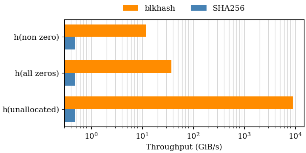

<!--
SPDX-FileCopyrightText: Red Hat Inc
SPDX-License-Identifier: LGPL-2.1-or-later
-->

# blkhash

Block based hash optimized for disk images.


Disk images are typically sparse, containing unallocated areas read as
zeros by the guest. The `blkhash` hash algorithm is optimized for
computing checksums of sparse disk images.

This project provides the `blksum` command and the `blkhash` C library.

## Installing

You can install the `blkhash` package on *Fedora*, *Centos Stream*, and
*RHEL* from the
[blkhash copr repo](https://copr.fedorainfracloud.org/coprs/nsoffer/blkhash/):

    dnf copr enable nsoffer/blkhash
    dnf install blkash

This installs the `blksum` command and the `libblkhash` library.

If you want to use the `libblkhash` library please install the
`blkhash-devel` package. Your application will depend on the
`blkhash-libs` package.

## The blksum command

The `blksum` command computes message digest for disk images, similar to
standard tools like `sha256sum`. For example to compute a sha256 block based
checksum of a raw image:

    $ blksum fedora-35.raw
    6e5c00c995056319d52395f8d91c7f84725ae3da69ffcba4de4c7d22cff713a5  fedora-35.raw

We could compute a checksum for this image using `sha256sum`:

    $ sha256sum fedora-35.raw
    88da042d3c4ad61091c25414513e74d2eaa7183f6c555476a9be55372ab284c6  fedora-35.raw

Note that the checksums are different! `blksum` computes a block based
sha256 checksum, not a sha256 checksum of the entire image.

See [blksum(1)](blksum.1.adoc) for the manual.

### Supported image formats

The advantage of the block based checksum is clear when you want to
compute the checksum of the same image in different image format. Let's
convert this image to qcow2 format:

    $ qemu-img convert -f raw -O qcow2 fedora-35.raw fedora-35.qcow2

This creates and identical image:

    $ qemu-img compare fedora-35.raw fedora-35.qcow2
    Images are identical.

But the file contents are different:

    $ ls -lhs fedora-35.*
    1.2G -rw-r--r--. 1 nsoffer nsoffer 1.2G Feb 27 12:48 fedora-35.qcow2
    1.2G -rw-r--r--. 1 nsoffer nsoffer 6.0G Jan 21 00:28 fedora-35.raw

Standard tools like `sha256sum` do not understand image formats, so they
compute a different checksum for the qcow2 image:

    $ sha256sum fedora-35.qcow2
    ae33f66851f5306bad5667ba7aabfea2d65cc2a13989e4fb0f73f4627861dbf2  fedora-35.qcow2

Because `blksum` understands image formats, it compute the same checksum:

    $ blksum fedora-35.qcow2
    6e5c00c995056319d52395f8d91c7f84725ae3da69ffcba4de4c7d22cff713a5  fedora-35.qcow2

Currently only `raw` and `qcow2` formats are supported. Any other format
is considered a raw image.

### Supported digest algorithms

The `blksum` command supports any message digest algorithm provided by
`openssl`. For example we can use `blake2b512`:

    $ blksum --digest blake2b512 fedora-35.qcow2
    fd2b46c3d5684fff9e1347299ef48d1a5c48cf3ec8ccf409112d6cd20e53874b7b2ab0c3a85d22e1cb63682796ecfa7687224131cf5d64c3e1e715c8e2848c34  fedora-35.qcow2

To find the available digest names run:

    $ blksum --list-digests
    blake2b512
    blake2s256
    md5
    md5-sha1
    sha1
    sha224
    sha256
    sha3-224
    sha3-256
    sha3-384
    sha3-512
    sha384
    sha512
    sha512-224
    sha512-256
    shake128
    shake256
    sm3

### Supported sources

The `blksum` command can compute a checksum for a file, block device, NBD
URI, or pipe.

For example, lets create a logical volume with the contents of the qcow2
image:

    $ sudo lvs -o vg_name,lv_name,size,attr data/test
      VG   LV   LSize Attr
      data test 6.00g -wi-a-----

    $ sudo qemu-img convert -f qcow2 -O qcow2 fedora-35.qcow2 /dev/data/test

The `blksum` command will compute the same checksum for the logical volume:

    $ sudo blksum /dev/data/test
    6e5c00c995056319d52395f8d91c7f84725ae3da69ffcba4de4c7d22cff713a5  /dev/data/test

The `blksum` command can also use a `NBD` URI, accessing an image exported
by `NBD` server such as `qemu-nbd`.

For example we can export an image using *qemu-nbd* using a unix socket:

    $ qemu-nbd --read-only --persistent --shared 8 --socket /tmp/nbd.sock \
        --format qcow2 fedora-35.qcow2 &

    $ blksum nbd+unix:///?socket=/tmp/nbd.sock
    6e5c00c995056319d52395f8d91c7f84725ae3da69ffcba4de4c7d22cff713a5  nbd+unix:///?socket=/tmp/nbd.sock

We can also access an image on a remote host using `NBD` TCP URI:

    $ qemu-nbd --read-only --persistent --shared 8 --format qcow2 fedora-35.qcow2 &

    $ blksum nbd://localhost
    6e5c00c995056319d52395f8d91c7f84725ae3da69ffcba4de4c7d22cff713a5  nbd://localhost

The `blksum` command does not support yet secure `NBD` connections, so its
use for accessing images on remote hosts is limited.

Finally, we can also compute a checksum for data written to a pipe:

    $ cat fedora-35.raw | blksum
    6e5c00c995056319d52395f8d91c7f84725ae3da69ffcba4de4c7d22cff713a5  -

Using a pipe we can only use `raw` format, and computing the checksum is
much less efficient.

### blksum performance

The `blksum` command uses *qemu-nbd* to get guest data from various
image formats and detect image sparseness, and use the `blkhash` library
to compute image checksum.

For typical 25% full sparse image, `blksum` is 15 times faster compared
with standard tools, using 3.7 times less cpu time:

```
$ hyperfine -w1 -p "sleep 2" "blksum 25p.raw" "sha256sum 25p.raw"
Benchmark 1: blksum 25p.raw
  Time (mean ± σ):     877.0 ms ±  33.3 ms    [User: 3380.8 ms, System: 606.0 ms]
  Range (min … max):   803.5 ms … 914.8 ms    10 runs

Benchmark 2: sha256sum 25p.raw
  Time (mean ± σ):     13.275 s ±  0.438 s    [User: 12.570 s, System: 0.672 s]
  Range (min … max):   12.828 s … 14.027 s    10 runs

Summary
  'blksum 25p.raw' ran
   15.14 ± 0.76 times faster than 'sha256sum 25p.raw'
```

For images with more data the speedup is smaller, and more cpu time is
used:

```
$ hyperfine -w1 -p "sleep 2" "blksum 50p.raw" "sha256sum 50p.raw"
Benchmark 1: blksum 50p.raw
  Time (mean ± σ):      1.951 s ±  0.151 s    [User: 7.522 s, System: 1.263 s]
  Range (min … max):    1.733 s …  2.200 s    10 runs

Benchmark 2: sha256sum 50p.raw
  Time (mean ± σ):     13.716 s ±  0.428 s    [User: 13.026 s, System: 0.660 s]
  Range (min … max):   12.903 s … 14.200 s    10 runs

Summary
  'blksum 50p.raw' ran
    7.03 ± 0.59 times faster than 'sha256sum 50p.raw'
```

But even when the image is 75% full `blkusum` is 4.5 time faster:

```
$ hyperfine -w1 -p "sleep 2" "blksum 75p.raw" "sha256sum 75p.raw"
Benchmark 1: blksum 75p.raw
  Time (mean ± σ):      3.019 s ±  0.233 s    [User: 12.063 s, System: 1.915 s]
  Range (min … max):    2.725 s …  3.518 s    10 runs

Benchmark 2: sha256sum 75p.raw
  Time (mean ± σ):     13.622 s ±  0.541 s    [User: 12.850 s, System: 0.737 s]
  Range (min … max):   13.028 s … 14.579 s    10 runs

Summary
  'blksum 75p.raw' ran
    4.51 ± 0.39 times faster than 'sha256sum 75p.raw'
```

When reading from a pipe we can use only raw image data and cannot
detect image sparseness, but zero detection and multiple threads are
effective:

```
$ hyperfine -w1 -p "sleep 2" "blksum <50p.raw" "sha256sum <50p.raw"
Benchmark 1: blksum <50p.raw
  Time (mean ± σ):      1.895 s ±  0.048 s    [User: 6.426 s, System: 0.622 s]
  Range (min … max):    1.825 s …  1.986 s    10 runs

Benchmark 2: sha256sum <50p.raw
  Time (mean ± σ):     13.039 s ±  0.536 s    [User: 12.369 s, System: 0.642 s]
  Range (min … max):   12.317 s … 14.103 s    10 runs

Summary
  'blksum <50p.raw' ran
    6.88 ± 0.33 times faster than 'sha256sum <50p.raw'
```

The best case is a completely empty image. `blksum` detects that the
entire image is unallocated without reading any data from storage and
optimize zero hashing:

```
$ hyperfine -w1 -p "sleep 2" "blksum empty-6g.raw" "sha256sum empty-6g.raw"
Benchmark 1: blksum empty-6g.raw
  Time (mean ± σ):      37.1 ms ±   6.8 ms    [User: 11.3 ms, System: 5.1 ms]
  Range (min … max):    27.1 ms …  44.1 ms    10 runs

Benchmark 2: sha256sum empty-6g.raw
  Time (mean ± σ):     13.522 s ±  0.557 s    [User: 12.795 s, System: 0.692 s]
  Range (min … max):   12.545 s … 14.190 s    10 runs

Summary
  'blksum empty-6g.raw' ran
  364.58 ± 68.72 times faster than 'sha256sum empty-6g.raw'
```

A less optimal case is a fully allocated image full of zeros. `blksum`
must read the entire image, but it detects that all blocks are zeros
and optimize zero hashing:

```
$ hyperfine -w1 -p "sleep 2" "blksum zero-6g.raw" "sha256sum zero-6g.raw"
Benchmark 1: blksum zero-6g.raw
  Time (mean ± σ):      2.041 s ±  0.011 s    [User: 0.446 s, System: 1.786 s]
  Range (min … max):    2.026 s …  2.065 s    10 runs

Benchmark 2: sha256sum zero-6g.raw
  Time (mean ± σ):     13.683 s ±  0.537 s    [User: 12.854 s, System: 0.790 s]
  Range (min … max):   13.024 s … 14.661 s    10 runs

Summary
  'blksum zero-6g.raw' ran
    6.70 ± 0.27 times faster than 'sha256sum zero-6g.raw'
```

The worst case is a completely full image, when nothing can be
optimized, but using multi-threading helps:

```
$ hyperfine -w1 -p "sleep 2" "blksum full-6g.raw" "sha256sum full-6g.raw"
Benchmark 1: blksum full-6g.raw
  Time (mean ± σ):      4.227 s ±  0.252 s    [User: 17.021 s, System: 2.683 s]
  Range (min … max):    3.777 s …  4.493 s    10 runs

Benchmark 2: sha256sum full-6g.raw
  Time (mean ± σ):     13.386 s ±  0.453 s    [User: 12.689 s, System: 0.655 s]
  Range (min … max):   13.006 s … 14.104 s    10 runs

Summary
  'blksum full-6g.raw' ran
    3.17 ± 0.22 times faster than 'sha256sum full-6g.raw'
```

### blksum --queue-size option

The `--queue-size` option limit the total size of in-flight `NBD`
requests. Testing shows that it can change the throughput by 10%,
depending on the machine. The default value (2097152) works well on on
tested machines.

Example run on *Lenovo ThinkPad P1 Gen 3* (i7-10850H CPU @ 2.70GHz) with
*Fedora 36*:

```
$ hyperfine -p "sleep 3" -L q 1048576,2097152,4194304,8388608 "blksum --queue-size {q} 50p.raw"
Benchmark 1: blksum --queue-size 1048576 50p.raw
  Time (mean ± σ):      1.873 s ±  0.066 s    [User: 7.274 s, System: 1.213 s]
  Range (min … max):    1.811 s …  2.014 s    10 runs

Benchmark 2: blksum --queue-size 2097152 50p.raw
  Time (mean ± σ):      1.926 s ±  0.046 s    [User: 7.541 s, System: 1.228 s]
  Range (min … max):    1.826 s …  2.006 s    10 runs

Benchmark 3: blksum --queue-size 4194304 50p.raw
  Time (mean ± σ):      1.988 s ±  0.070 s    [User: 7.857 s, System: 1.307 s]
  Range (min … max):    1.879 s …  2.103 s    10 runs

Benchmark 4: blksum --queue-size 8388608 50p.raw
  Time (mean ± σ):      2.043 s ±  0.092 s    [User: 8.035 s, System: 1.427 s]
  Range (min … max):    1.954 s …  2.222 s    10 runs

Summary
  'blksum --queue-size 1048576 50p.raw' ran
    1.03 ± 0.04 times faster than 'blksum --queue-size 2097152 50p.raw'
    1.06 ± 0.05 times faster than 'blksum --queue-size 4194304 50p.raw'
    1.09 ± 0.06 times faster than 'blksum --queue-size 8388608 50p.raw'
```

Example run on *Dell PowerEdge R640* (Xeon(R) Gold 5218R CPU @ 2.10GHz)
with *RHEL 8.5*:

```
# hyperfine -w1 -L q 1048576,2097152,4194304,8388608 "blksum --queue-size {q} 50p.raw"
Benchmark 1: blksum --queue-size 1048576 50p.raw
  Time (mean ± σ):      1.877 s ±  0.026 s    [User: 7.245 s, System: 1.271 s]
  Range (min … max):    1.852 s …  1.926 s    10 runs

Benchmark 2: blksum --queue-size 2097152 50p.raw
  Time (mean ± σ):      1.718 s ±  0.023 s    [User: 7.302 s, System: 1.221 s]
  Range (min … max):    1.691 s …  1.772 s    10 runs

Benchmark 3: blksum --queue-size 4194304 50p.raw
  Time (mean ± σ):      1.697 s ±  0.014 s    [User: 7.233 s, System: 1.261 s]
  Range (min … max):    1.680 s …  1.726 s    10 runs

Benchmark 4: blksum --queue-size 8388608 50p.raw
  Time (mean ± σ):      1.700 s ±  0.017 s    [User: 7.253 s, System: 1.261 s]
  Range (min … max):    1.680 s …  1.740 s    10 runs

Summary
  'blksum --queue-size 4194304 50p.raw' ran
    1.00 ± 0.01 times faster than 'blksum --queue-size 8388608 50p.raw'
    1.01 ± 0.02 times faster than 'blksum --queue-size 2097152 50p.raw'
    1.11 ± 0.02 times faster than 'blksum --queue-size 1048576 50p.raw'
```

## The blkhash library

The `blkhash` C library implements the block based hash algorithm, zero
detection, and used multiple threads to speed up the computation.

The library provides the expected interface for creating, updating,
finalizing and destroying a hash. The `blkhash_update()` function
implements zero detection, speeding up data processing. When you know
that some areas of the image are read as zeros, you can skip reading
them and use `blkhash_zero()` to add zero range to the hash.

See the [example program](example.c) for example of using the library.

See [blkhash(3)](blkhash.3.adoc) for complete documentation.

### blkhash performance

The `blkhash` library is up to 4 order of magnitude faster than openssl
using the same digest algorithm.

We measured the throughput of the `blkhash` library using `sha256`
algorithm and 64 threads for 3 operations:
- `h(non zero)` - hash non-zero data
- `h(all zeros)` - hash data that is all zeros
- `h(unallocated)` - hash an unallocated area (logically filled with zeros)

The following graph compares the throughput to `sha256` using
logarithmic scale.  The throughput of hashing unallocated area is *18,649
times higher*, hashing zeros is *76 times higher*, and hashing non-zero
data is *24 times higher*.



For more info on benchmarking `blkhash` see
[test/README.md](test/#the-blkhash-bench-program) and the
[tests results](test/results).

## Portability

The `blkhash` library and `blksum` command are developed on Linux, but
should be portable to any platform where openssl is available. Some
optimizations are implemented only for Linux.

The `blksum` command requires
[libnbd](https://libguestfs.org/libnbd.3.html) for `NBD` support, and
[qemu-nbd](https://www.qemu.org/docs/master/tools/qemu-nbd.html) for
`qcow2` format support. If `libnbd` is not available, `blksum` is built
without `NBD` support and can be used only with `raw` images.

### Testing status

Only some variants have CI. Most variants are tested only in `copr`
build system or have no automated testing.

| OS                | Arch          | CI                | libnbd |
|-------------------|---------------|-------------------|--------|
| Fedora 37         | x86_64        | gitlab, circleci  | yes    |
| Fedora 38         | x86_64        | gitlab, circleci  | yes    |
| CentOS Stream 8   | x86_64        | gitlab, circleci  | yes    |
| CentOS Stream 9   | x86_64        | gitlab, circleci  | yes    |
| Fedora 36         | aarch64       | copr              | yes    |
| Fedora 36         | ppc64le       | copr              | yes    |
| Fedora 36         | s390x         | copr              | yes    |
| Fedora 36         | x86_64        | copr              | yes    |
| Fedora 37         | aarch64       | copr              | yes    |
| Fedora 37         | ppc64le       | copr              | yes    |
| Fedora 37         | s390x         | copr              | yes    |
| Fedora 37         | x86_64        | copr              | yes    |
| Fedora 38         | aarch64       | copr              | yes    |
| Fedora 38         | ppc64le       | copr              | yes    |
| Fedora 38         | s390x         | copr              | yes    |
| Fedora 38         | x86_64        | copr              | yes    |
| CentOS Stream 8   | aarch64       | copr              | yes    |
| CentOS Stream 8   | ppc64le       | copr              | yes    |
| CentOS Stream 8   | x86_64        | copr              | yes    |
| CentOS Stream 9   | aarch64       | copr              | yes    |
| CentOS Stream 9   | ppc64le       | copr              | yes    |
| CentOS Stream 9   | s390x         | copr              | yes    |
| CentOS Stream 9   | x86_64        | copr              | yes    |
| EPEL 8            | aarch64       | copr              | yes    |
| EPEL 8            | ppc64le       | copr              | yes    |
| EPEL 8            | s390x         | copr              | yes    |
| EPEL 8            | x86_64        | copr              | yes    |
| EPEL 9            | aarch64       | copr              | yes    |
| EPEL 9            | ppc64le       | copr              | yes    |
| EPEL 9            | s390x         | copr              | yes    |
| EPEL 9            | x86_64        | copr              | yes    |
| RHEL 8.6          | x86_64        | no                | yes    |
| FreeBSD 13        | x86_64        | no                | no     |
| macOS 13 Ventura  | Apple Silicon | no                | no     |

## Contributing to blkhash

Please see [CONTRIBUTING.md](CONTRIBUTING.md).

## Related projects

- The `blkhash` algorithm is based on
  [ovirt-imageio](https://github.com/oVirt/ovirt-imageio)
  [blkhash module](https://github.com/oVirt/ovirt-imageio/blob/master/ovirt_imageio/_internal/blkhash.py).

- The `blksum` command `NBD` support is powered by the
  [libnbd](https://gitlab.com/nbdkit/libnbd/) library.

## License

`blkhash`is licensed under the GNU Lesser General Public License version
2.1 or later. See the file `LICENSES/LGPL-2.1-or-later.txt` for details.
