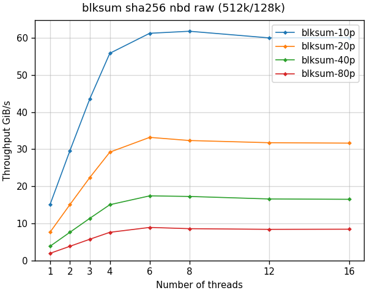
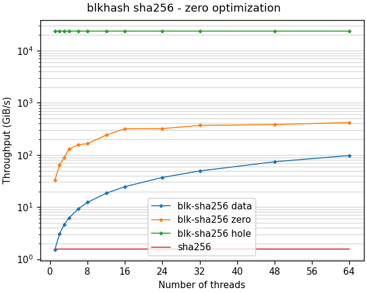

<!--
SPDX-FileCopyrightText: Red Hat Inc
SPDX-License-Identifier: LGPL-2.1-or-later
-->

# blkhash

Block based hash optimized for disk images.

Disk images are typically sparse, containing unallocated areas read as
zeros by the guest. The `blkhash` hash construction is optimized for
computing checksums of sparse disk images.

This project provides the `blksum` command and the `blkhash` C library.

## Installing

You can install the `blkhash` package on *Fedora*, *Centos Stream*, and
*RHEL* from the
[blkhash copr repo](https://copr.fedorainfracloud.org/coprs/nsoffer/blkhash/):

    dnf copr enable nsoffer/blkhash
    dnf install blkash

This installs the `blksum` command and the `libblkhash` library.

If you want to use the `libblkhash` library please install the
`blkhash-devel` package. Your application will depend on the
`blkhash-libs` package.

## The blksum command

The `blksum` command computes message digest for disk images, similar to
standard tools like `sha256sum`.

Why use `blksum`?

- Much faster - up to 4 orders of magnitude faster compared with common
  tools such as `sha256sum`.
- Support `qcow2` and `raw` image formats - images with same content
  but different format have the same checksum.
- Support multiple sources - file, block device, pipe, or NBD URL
- Configurable digest algorithms - using `BLAKE3`, `SHA256` or other
  digest algorithms provided by `openssl`

Here is a graph showing `blksum` throughput in GiB/s using `SHA256`
digest algorithm:

- See [blksum](docs/blksum.md) to learn more about the `blksum`
  command and how to use it.
- See [blksum performance](docs/blksum-performance.md) to learn more
  about `blksum` performance.

## The blkhash library

The `blkhash` C library implements the block based hash construction, using
zero detection and multiple threads to speed up the computation.

The library provides 2 APIs:

- The simple API - easy to use API similar to other hashing libraries
  like `openssl`
- The async API - high performance API for very fast storage and large
  number of threads

Here is a graph showing `blkhash` throughput in GiB/s using `SHA256`
digest algorithm:

- See [blkhash](docs/blkhash.md) to learn more about the `blkhash`
  library and how to use it.
- See [blkhash performance](docs/blkhash-performance.md) to learn more
  about `blkhash` performance.

## The blkhash paper

For in-depth discussion of the `blkhash` construction and proof of
security, please check
[the blkhash paper](https://www.scitepress.org/PublicationsDetail.aspx?ID=PbV0U1TDO90=):
Soffer, N. and Waisbard, E.  (2024). An Efficient Hash Function
Construction for Sparse Data. In Proceedings of the 21st International
Conference on Security and Cryptography - SECRYPT; ISBN
978-989-758-709-2; ISSN 2184-7711, SciTePress, pages 698-703. DOI:
10.5220/0012764500003767.

## Portability

The `blkhash` library and `blksum` command are developed on Linux, but
should be portable to any platform where openssl is available. Some
optimizations are implemented only for Linux.

The `blkhash` library requires:
- [openssl](https://www.openssl.org/) for `SHA256` and other digest
  algorithms
- [blake3](https://github.com/BLAKE3-team/BLAKE3/) for `BLAKE3` digest
algorithm

The `blksum` command requires:
- [libnbd](https://libguestfs.org/libnbd.3.html) for `NBD` support
- [qemu-nbd](https://www.qemu.org/docs/master/tools/qemu-nbd.html) for
`qcow2` format support

See [portability](docs/portability.md) for more info.

## Contributing to blkhash

Contribution is welcome!

We need help with:

- Testing with different storage, machines, and systems
- Reporting issues or ideas for new features
- Improving the documentation
- Packaging for more systems
- Porting to more systems
- Implementing new features or fixing bugs
- Integration with other projects

Please see [CONTRIBUTING.md](CONTRIBUTING.md) to learn how you can
contribute to the project.

## Related projects

- The `blkhash` construction is based on
  [ovirt-imageio](https://github.com/oVirt/ovirt-imageio)
  [blkhash module](https://github.com/oVirt/ovirt-imageio/blob/master/ovirt_imageio/_internal/blkhash.py).

- The `blksum` command `NBD` support is powered by the
  [libnbd](https://gitlab.com/nbdkit/libnbd/) library.

## License

`blkhash`is licensed under the GNU Lesser General Public License version
2.1 or later. See the file `LICENSES/LGPL-2.1-or-later.txt` for details.
