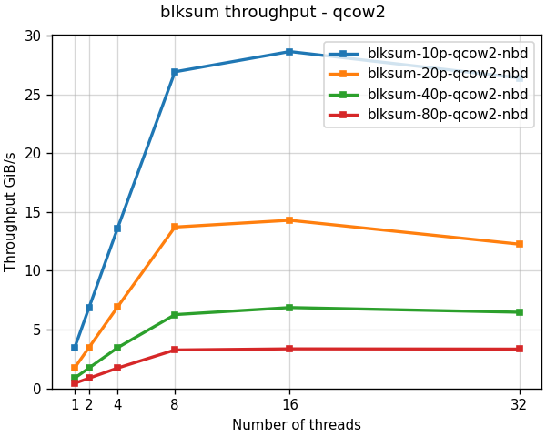

<!--
SPDX-FileCopyrightText: Red Hat Inc
SPDX-License-Identifier: LGPL-2.1-or-later
-->

# blkhash

Block based hash optimized for disk images.

Disk images are typically sparse, containing unallocated areas read as
zeros by the guest. The `blkhash` hash algorithm is optimized for
computing checksums of sparse disk images.

This project provides the `blksum` command and the `blkhash` C library.

## Installing

You can install the `blkhash` package on *Fedora*, *Centos Stream*, and
*RHEL* from the
[blkhash copr repo](https://copr.fedorainfracloud.org/coprs/nsoffer/blkhash/):

    dnf copr enable nsoffer/blkhash
    dnf install blkash

This installs the `blksum` command and the `libblkhash` library.

If you want to use the `libblkhash` library please install the
`blkhash-devel` package. Your application will depend on the
`blkhash-libs` package.

## The blksum command

The `blksum` command computes message digest for disk images, similar to
standard tools like `sha256sum`.

Unlike standard tools, `blksum`:

- Understands image format - compute a checksum of the guest visible data
- Much faster - up to 4 orders of magnitude faster compared with standard tools
- Support multiple sources - file, block device, pipe, NBD URL
- Configurable digest algorithms - using any digest algorithm from `openssl`

Here is a graph comparing `blksum` and `sha256sum` throughput in GiB/s:

See [blksum](docs/blksum.md) for more info.

## The blkhash library

The `blkhash` C library implements the block based hash algorithm, using
zero detection and multiple threads to speed up the computation.

The library provides 2 APIs:

- The simple API - easy to use API similar to other hashing libraries
  like `openssl`
- The async API - high performance API for very fast storage and large
  number of threads

Here is a graph comparing `blkhash` and `sha256` throughput in GiB/s:

- See [blkhash](docs/blkhash.md) to learn more about the `blkhash`
  library and how to use it.
- See [blkhash performance](docs/blkhash-performance.md) to learn more
  about `blkhash` performance.

## Portability

The `blkhash` library and `blksum` command are developed on Linux, but
should be portable to any platform where openssl is available. Some
optimizations are implemented only for Linux.

The `blksum` command requires
[libnbd](https://libguestfs.org/libnbd.3.html) for `NBD` support, and
[qemu-nbd](https://www.qemu.org/docs/master/tools/qemu-nbd.html) for
`qcow2` format support.

See [portability](docs/portability.md) for more info.

## Contributing to blkhash

Contribution is welcome!

We need help with:

- Testing with different storage, machines, and systems
- Reporting issues or ideas for new features
- Improving the documentation
- Packaging for more systems
- Porting to more systems
- Implementing new features or fixing bugs
- Integration with other projects

Please see [CONTRIBUTING.md](CONTRIBUTING.md) to learn how you can
contribute to the project.

## Related projects

- The `blkhash` algorithm is based on
  [ovirt-imageio](https://github.com/oVirt/ovirt-imageio)
  [blkhash module](https://github.com/oVirt/ovirt-imageio/blob/master/ovirt_imageio/_internal/blkhash.py).

- The `blksum` command `NBD` support is powered by the
  [libnbd](https://gitlab.com/nbdkit/libnbd/) library.

## License

`blkhash`is licensed under the GNU Lesser General Public License version
2.1 or later. See the file `LICENSES/LGPL-2.1-or-later.txt` for details.
