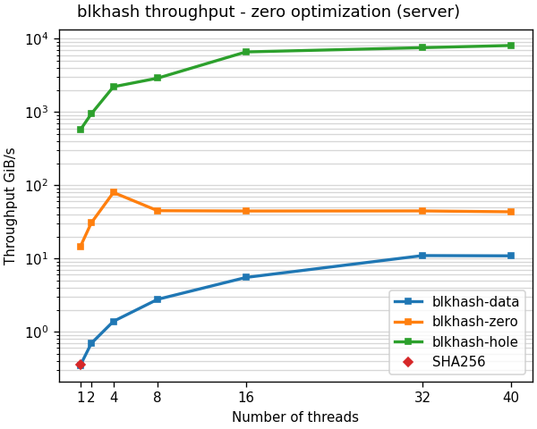

<!--
SPDX-FileCopyrightText: Red Hat Inc
SPDX-License-Identifier: LGPL-2.1-or-later
-->

# blkhash performance

The `blkhash` library is up to 4 order of magnitude faster than openssl
using the same digest algorithm.

`blkhash` improves performance in several ways:

- Zero optimization - avoiding the work for computing a hash for
  unallocated ares in an image, or areas full of zeroes.
- Parallel computation - computing hashes in parallel using multiple
  threads.
- Asynchronous API - speeding up hashing with large number of threads
  and integrating well with asynchronous I/O libraries

## Zero optimization

`blkhash` can be up to 4 orders of magnitude faster than SHA256,
depending on the image content.

The following graph shows zero optimization performance for 3 cases:

- data - hashing buffer full of non-zero data
- zero - hashing buffer full of zeros
- hole - hashing unallocated area

## Parallel computation

After optimizing unallocated areas and areas full with zeros, we still
need to compute the hashes for data blocks. The only way to speed this
operation is with parallel computation.

The easy to use API scales well up to 8 cores. When using larger number
of cores, the asynchronous API scales well up to 32 cores up to 31.5
times faster compared to SHA256.

The following graph shows parallel computing performance with 2 cases:
- blkhash - the simple API
- blkhash-aio - the asynchronous API

## Tested hardware

The benchmarks shown here ran on *Dell PowerEdge R640* with this
configuration:

- kernel: Linux-4.18.0-425.13.1.el8_7.x86_64-x86_64-with-glibc2.28
- online cpus:  40
- smt: off
- cpu: Intel(R) Xeon(R) Gold 5218R CPU @ 2.10GHz
- tuned-profile: latency-performance

## How we test

`blkhash` performance is tested using the `blkhash-bench` program,
measuring the throughput of the library by hashing buffers directory
into the library, without actual I/O.

The benchmarks were run using
[bench-zero-optimization.py](../test/bench-zero-optimization.py)
and [bench-parallel.py](../test/bench-parallel.py) generating json test
results.

The graphs were created using the [plot.py](../test/plot.py) tool from
the json test results.

See [blksum performance](blksum-performance.md) for computing a hash of
actual disk images on storage.

See the [test/results](../test/results) directory for test results and
images.
