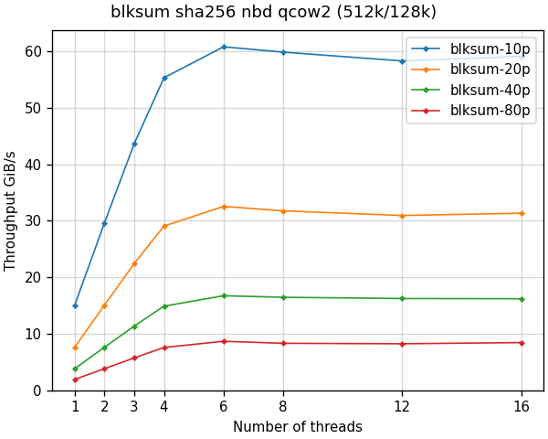

<!--
SPDX-FileCopyrightText: Red Hat Inc
SPDX-License-Identifier: LGPL-2.1-or-later
-->

# blksum performance

`blksum` can be up to 4 orders of magnitude faster than sha256sum,
depending on the contents of the image, image format, and the way we
read the image.

## Real images

The most important factor is how much non-zero data is in the image. For
images full of data, we are limited by storage throughput. For very
sparse images we get dramatic improvement.

The following graphs compare the throughput using 4 images:

- 10p - 10% full image
- 20p - 20% full image
- 40p - 40% full image
- 80p - 80% full image




## Tested hardware

The benchmarks shown here ran on *AWS c7g.metal* instance with 64 cores
running *Ubuntu*.

## How we test

`blksum` performances is tested by running the `blksum` with real images
on local storage with various number of threads. This measures real
world performance of the command, which is typically limited by storage
throughput.

The real images for the benchmark are created using the
[make-images.py](../test/make-images.py) tool. This tool requires the
`virt-builder` command and works only on Linux.

The results were generated by running `bench/run` tool:

```
bench/run bench/blksum.yaml
```

The graphs were created from the test results json files using the
[plot-blksum.py](../test/plot-blksum.py) tool.

See [blkhash performance](blkhash-performance.md) to learn about the
maximum throughput possible using the `blkhash` library.

See the [test/results](../test/results) directory for test results and
images.
