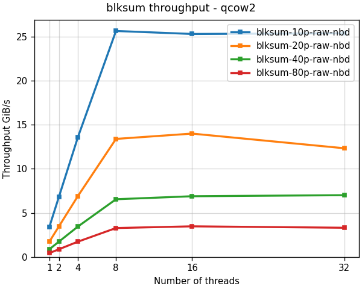
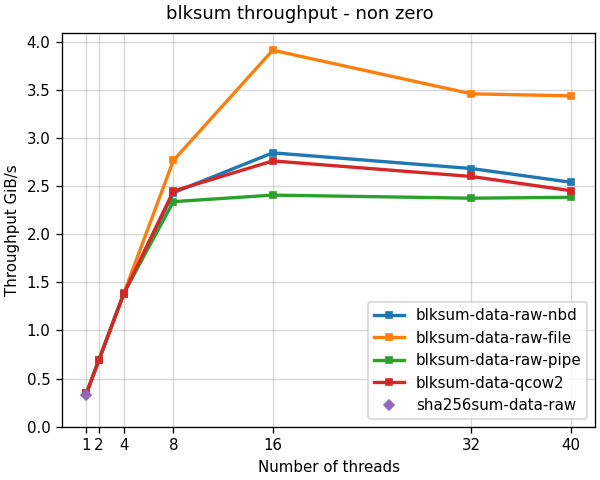
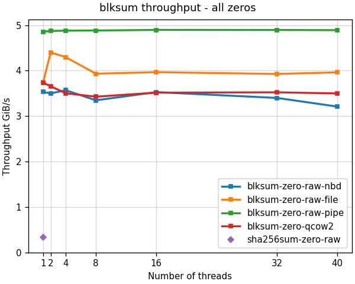
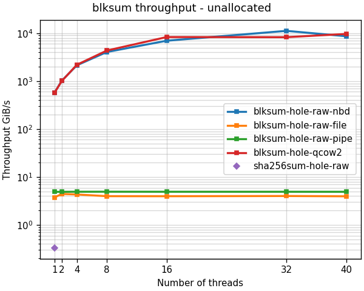

<!--
SPDX-FileCopyrightText: Red Hat Inc
SPDX-License-Identifier: LGPL-2.1-or-later
-->

# blksum performance

`blksum` can be up to 4 orders of magnitude faster than sha256sum,
depending on the contents of the image, image format, and the way we
read the image.

## Real images

The most important factor is how much non-zero data is in the image. For
images full of data, we are limited by storage throughput. For very
sparse images we get dramatic improvement.

The following graphs compare the throughput using 4 images:

- 10p - 10% full image
- 20p - 20% full image
- 40p - 40% full image
- 80p - 80% full image




## Image full of data

The worst case for `blksum` is an image full of non-zero data. In this
case, `blksum` must read the entire image from storage which limit the
throughput.

Reading from storage is faster when we access the image directly, but
this works only for raw images, and image allocation is not supported in
this case.

The following graph compares hashing of 100% full qcow2 and raw images,
read via NBD, file, and pipe:

- qcow2-nbd: qcow2 image read via NBD
- raw-nbd: raw image read via NBD
- raw-file: raw image read directly from file
- raw-pipe: raw image read from pipe



## Image full of zeros

In this case `blksum` must read the entire image from storage, but hashing
the image is practically free. The number of threads do not matter since
we are waiting for storage.

Reading from storage is faster when reading the image directly from file
or from pipe, compared with reading the image via NBD.

The following graph compares hashing of qcow2 and raw images full with
zeros, read via NBD, file, and pipe:

- qcow2-nbd: qcow2 image read via NBD
- raw-nbd: raw image read via NBD
- raw-file: raw image read directly from file
- raw-pipe: raw image read from pipe



## Empty image

When reading empty image via NBD, `blksum` does not read anything from
storage, and can hash the data up to 4 orders of magnitude faster than
sha256sum.

When reading the image directly from file or via a pipe, blksum must
read the entire image. The results are similar to hashing an image full
of zeros.

The following graph compares hashing of qcow2 and raw empty images read
via NBD, file, and pipe:

- qcow2-nbd: qcow2 image read via NBD
- raw-nbd: raw image read via NBD
- raw-file: raw image read directly from file
- raw-pipe: raw image read from pipe



## Tested hardware

The benchmarks shown here ran on *Dell PowerEdge R640* with this
configuration:

- kernel: Linux-4.18.0-425.13.1.el8_7.x86_64-x86_64-with-glibc2.28
- online cpus:  40
- smt: off
- cpu: Intel(R) Xeon(R) Gold 5218R CPU @ 2.10GHz
- tuned-profile: latency-performance

## How we test

`blksum` performances is tested by running the `blksum` with real images
on local storage with various number of threads. This measures real
world performance of the command, which is typically limited by storage
throughput.

The real images for the benchmark are created using the
[make-images.py](../test/make-images.py) tool. This tool requires the
`virt-builder` command and works only on Linux.

The results were collected by multiple runs of `hyperfine` tool for
every image:

```
hyperfine -L t 1,2,4,8,16,32 \
  "build/bin/blksum -t {t} -c ../blksum/{10,20,40,80}p.{raw,qcow2}" \
  --export-json test/results/2023-06/server/blksum-{10,20,40,80}p-{raw,qcow2}-nbd.json
```

The graphs were created from the test results json files using the
[plot-blksum.py](../test/plot-blksum.py) tool.

See [blkhash performance](blkhash-performance.md) to learn about the
maximum throughput possible using the `blkhash` library.

See the [test/results](../test/results) directory for test results and
images.
